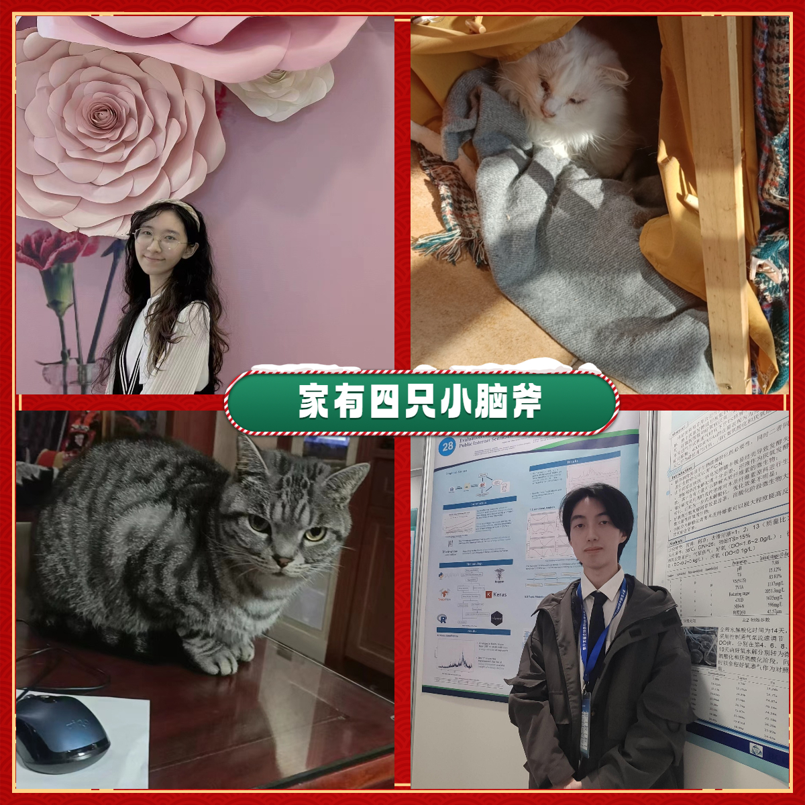

---
header:
  caption: ""
  image: ""
title:  我挚爱的家 / My lovely family
type: page
view: 2
---

我们的家庭由四只小老虎组成。她(zsj)是家的核心，无论我面临什么困难，她一直都对我充满了爱与支持，包容了我的孩子气与错误。我们互相扶持，一起度过了五年岁月。洞洞和兔兔是两只小老虎，他们精力充沛，都在她的身边开心地生活，一天天陪伴着我们长大。

Welcome to our family of four little tigers! We are a fiercely loyal and loving family, always ready to support and protect each other (for two cats, sometimes they fight though). Whether we are tackling a new challenge or simply enjoying a family outing, we always do it with energy and determination. Our bond is strong and unbreakable, and we are grateful to have each other through all of life's ups and downs. As the "four little tigers," we may be small in number, but we are mighty in spirit and full of love for one another.

