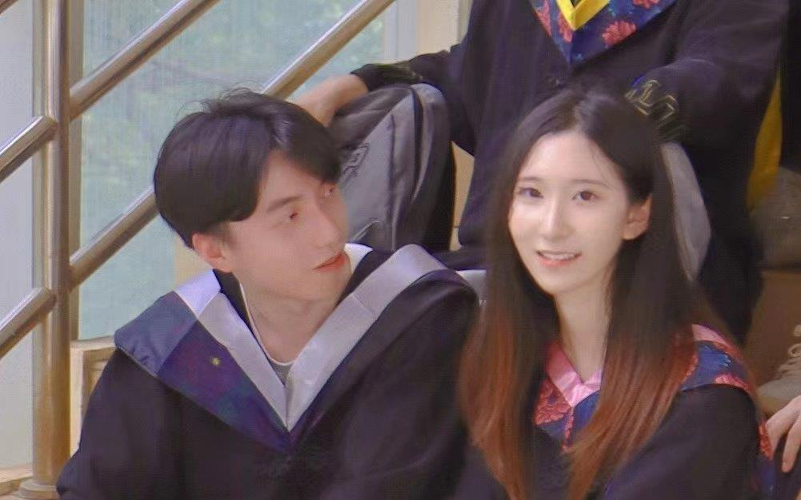

---
header:
  caption: ""
  image: ""
title: 告白/最后的话
type: page
view: 2
---

这几天我又哭又笑。看到我们的照片，我真的很开心，翻过我们五年的回忆，我冲着可爱的你、傻傻的我笑个不停。

然而回到现实，只是一直哭泣，哭到实在困得睡去，几小时后的黎明时刻，被枕边的眼泪凉醒。望着黑漆漆的夜，一遍遍看着我们的对话框。

从小到大我没有那么一次伤心过。甚至比看到妈妈离开我，坐在自行车后坐远去还要难过。可能因为你是世界上除了外公外婆对我最好的人，对你的离开，我自然的联想是这幅童年噩梦般的画面。

我回顾我们的交流，关键的问题还是彼此的安全感。可能因为我的成长经历，我一直恐惧真情流露，一直在回避内心的感受，让你感觉不到我的爱意。甚至我自己也可以察觉到这种回避：如在同你玩情感本的时候，我因害怕有情感表达而装做不在意、如看完爱情电影说一点意思都没有。波澜起伏的情绪被我压制，好像表达了内心我就会受伤一样。事实上，因为这种懦弱的自我保护，让心意相通的我们产生隔阂。有意或无意，都让你受到了伤害，成为了埋在我们感情里不安的种子。

此外，在异地的情况下，我一直不懂你的需求，我一直自以为是，一直让你感到委屈、愤怒与失望。你一直在为我付出，而我却将我眼中的“对你好”强加给你。事实上，超长的工作时长、疯狂接单、卷论文，并不是“我在对你好”，而只是缓解我的焦虑和自卑。
我一点都不理解你的心，轻易的相信胡扯的观点。我不该相信什么“我教你做保证有流量”、“赚钱了你告诉她，她自然就高兴的”这样的鬼话。这种指导下带来的让人高度怀疑的举动，让我们本就不安全的信任坍塌。我本意并非如此，这些让我愧疚万分，也心如刀割。前几天你闺蜜说“底线是是伴侣来定的”真的有把我点醒，我不该认为每个人有自己的底线和边界，当你是我的伴侣的时候，你才是我底线的掌握者与制定者。虽然我从未想对你不忠诚、从未想辜负你的真心，但是我所谓的“自己的底线”伤害了你，这成为了长期安全感问题的导火索。我真的很自责，我的心不是坏的，也不是一个人渣，我感到真的很愧疚和抱歉。

在这个初恋的养成里，我醒悟的太晚太晚，给你带来了太多的失望。我知道自己爱你，但却做着南辕北辙的事情而不自知。这些天没有你的痛苦让我明白，自己之前的行为是多自私而错误的。

如果可以给我最后一次机会，我一定会当一个宠妻狂魔，不再回避自己的感觉。我会大声的喊出来，让全世界知道我爱你。我会让我家所有亲戚朋友都记得你的名字，记得这是我的挚爱。我会无时无刻抓紧你的手，给你我所有的温暖。我会把你接到我家来（倒插门也行），让我们彼此全天候的陪伴。我会以你为中心，踏踏实实同你一起奋斗，远离所有可能伤害你的因素。我会继续上进，给你完美的婚礼。在五年里，这是第三次我们超过三天的吵架，我保证这是最后一次让你因此委屈。借助这个我们的公众号发表，上面是我的忏悔、我的决心，同时也是我对你的承诺，天地共证。

如果还有可能的话，请接受我最诚挚的歉意。

对不起，我最爱的人。

##### 链接到..
[我们的家](https://ziqian-xia.tech/family/)