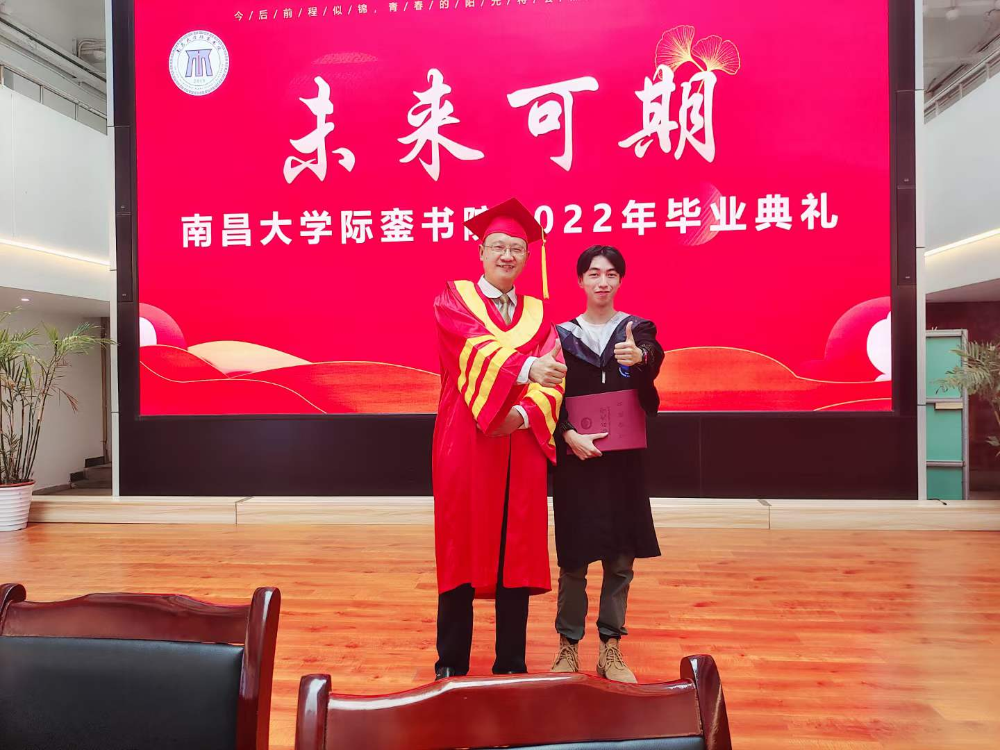
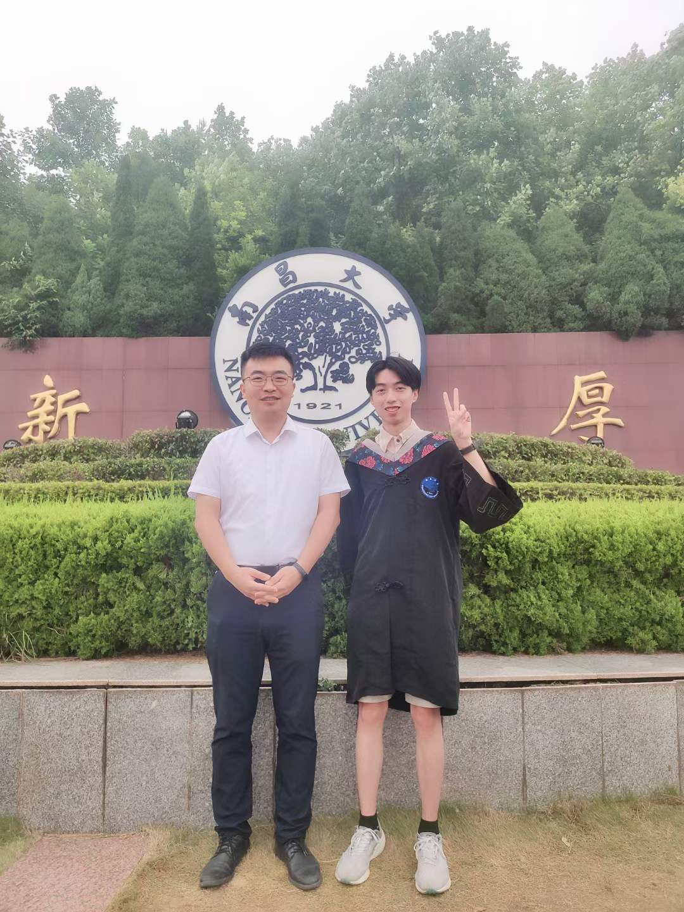
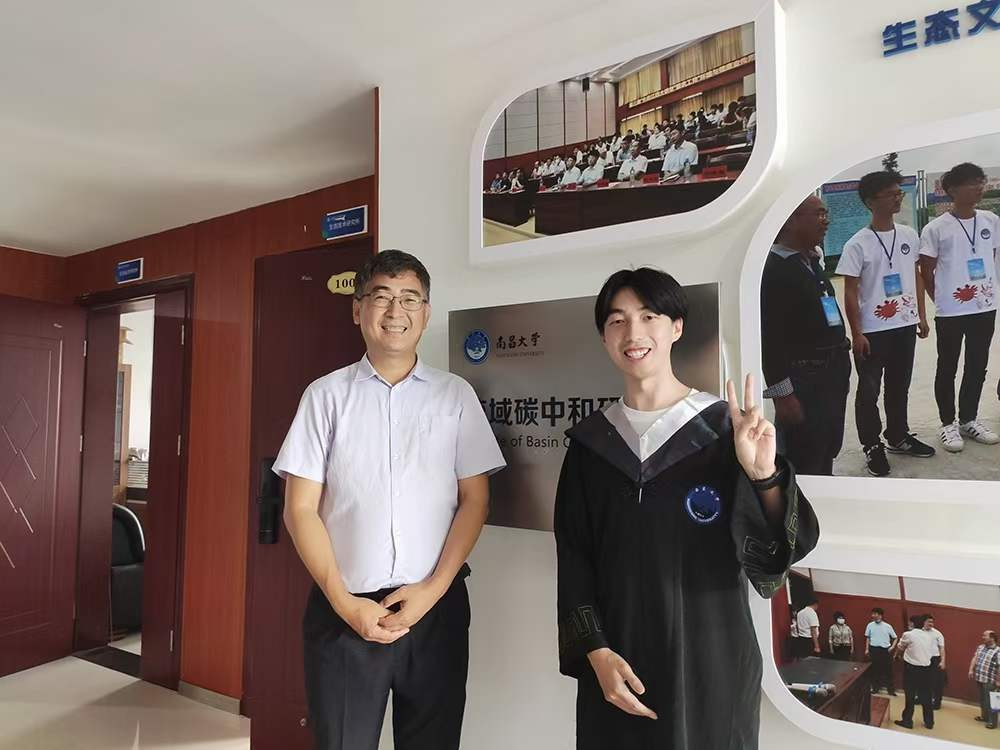
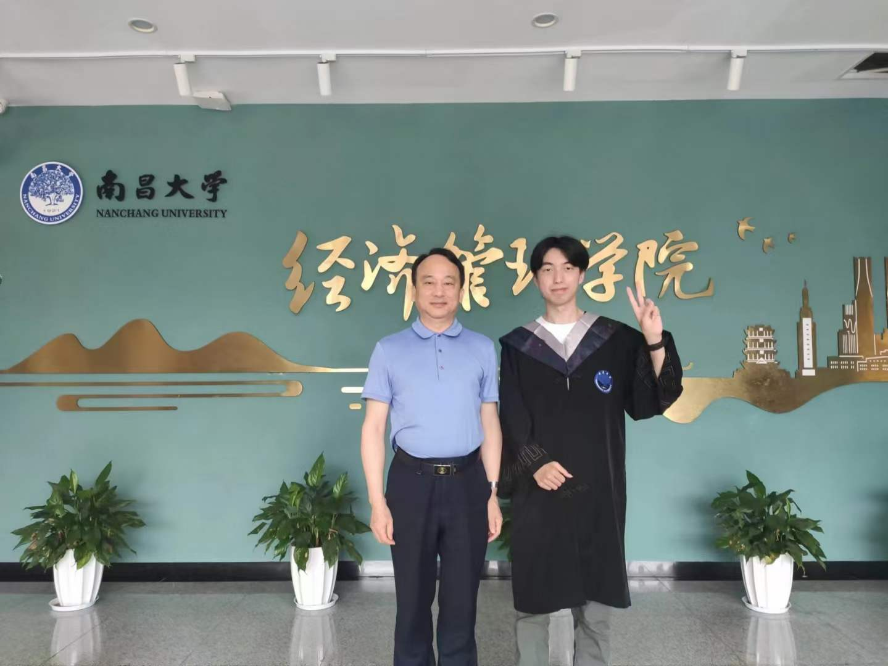
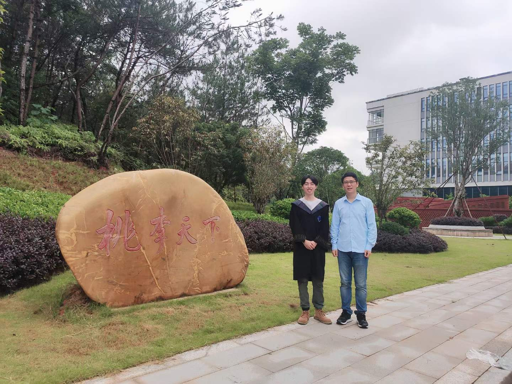
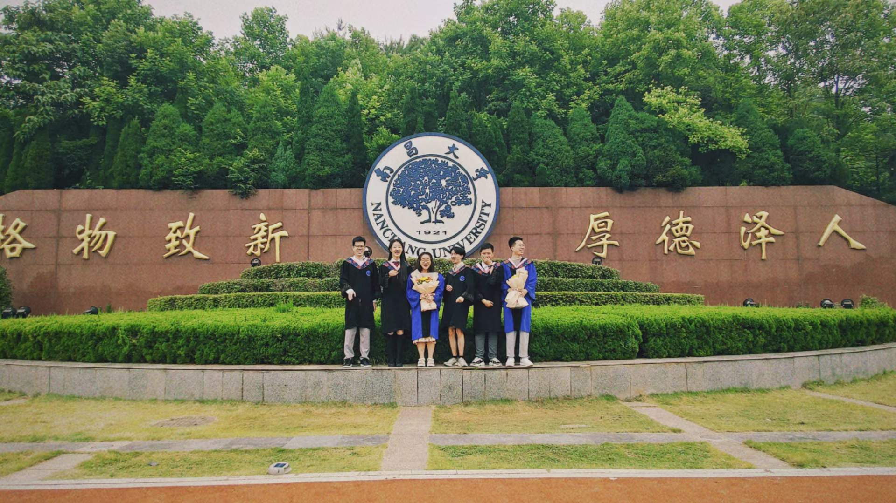
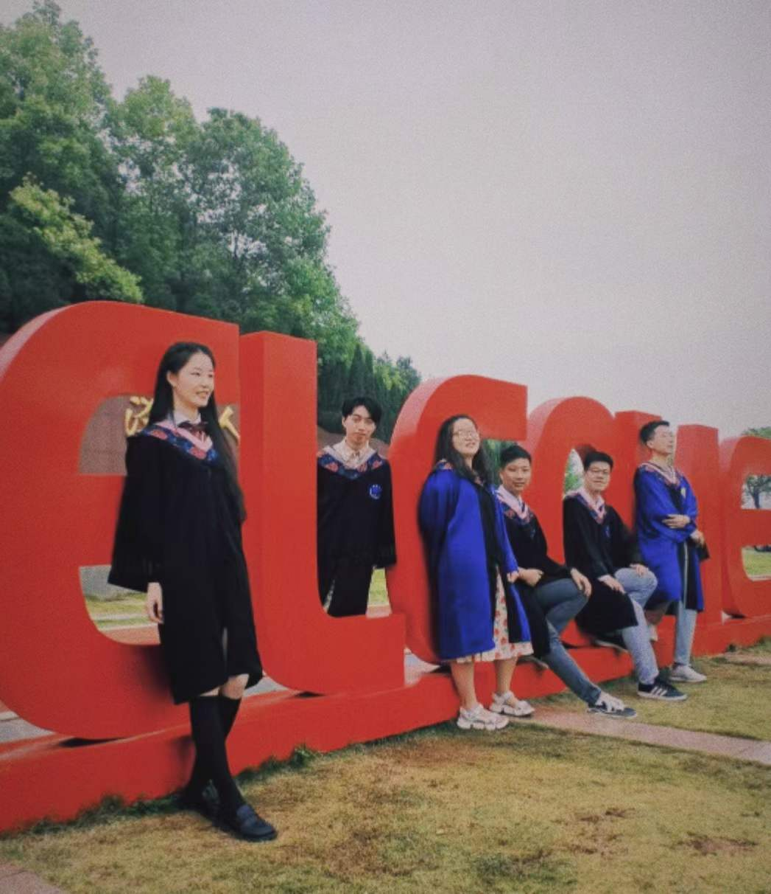
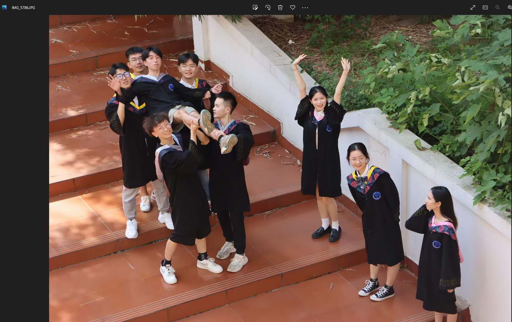
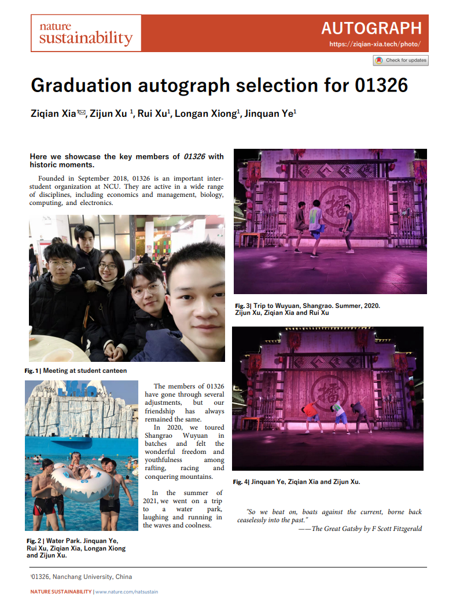
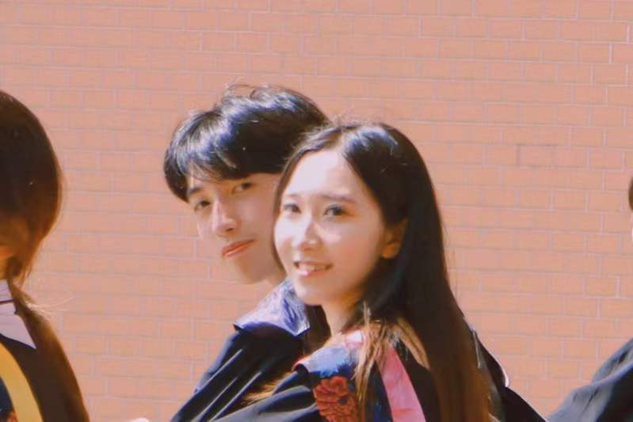

---
header:
  caption: ""
  image: ""
title: 毕业纪念
type: page
view: 2
---

## 这里存放了毕业相册 (更新中，还有一些没p图)：

### 与敬爱的老师们 （更新中）

↑ 2022.6.20 与[刘校长](http://www.ncu.edu.cn/xxgk/zljgxq/zljg_lyb.html)在书院的合影。当时刘校长比了三个姿势（比心、画心、点赞），吸引了超多同学。接下来的十几分钟里大家排队和刘校长合影，书院里回荡着“比心、画心、点赞”的声音...

↑ 2022.6.15 与[田老师](http://sem.ncu.edu.cn/szdw/gccrc/gccrcjxssqjhljrc/799a668ea7be430c9edb199b04109392.htm)在校门口的合影。田老师是我的本科导师，也是学术路上的引路人([See our pubs](https://ziqian-xia.tech/publist/))。这张照片拍摄的日子天气不是很好，看起来灰蒙蒙的，不过于我意义非凡。宝藏导师！推荐！推荐！推荐！

↑ 2022.6.20 与[石老师](http://zhxy.ncu.edu.cn/rcypy/dsml/3338722c8dc44ceb8b5eee4101764fe5.htm)在生态文明研究院的合影。石老师儒雅博学，与其交谈总能有很多收获。每次到1007，闻到隔壁咖啡的香味，我就知道，石老师已经在工作了。这张照片是谢金良学长拍摄的，很nice！

↑ 2022.6.20 与[彭老师](https://baike.baidu.com/item/%E5%BD%AD%E8%BF%AA%E4%BA%91/10706973?fr=aladdin)在经管楼下的合影。彭老师是我大一学年的导师，在刚入学的一年里，作为一个真正的萌新，彭老师给予了我许多帮助。

↑ 2022.6.20 与[吴老师](https://baike.baidu.com/item/%E5%90%B4%E5%86%9B%E5%BB%BA/6169974?fr=aladdin)在经管楼下的合影。吴老师研究的领域是运营管理、博弈论与契约设计。大二期间跟随他进行了一些尝试，可能是我数学基础还是不太行，最终没有做出成果来。这期间吴老师一直给予了很多帮助，那段解方程的时间令我终身难忘。

### 与小伙伴们（更新中）

下面是课题组的小伙伴们，1007是我们的精神家园。希望以后回来1007还在！！

下面是好兄弟与他们的（前）女友们，这张还没修过，感觉好青春啊！终于年轻了一把！

寝室的毕业纪念册!

### 特别放送

