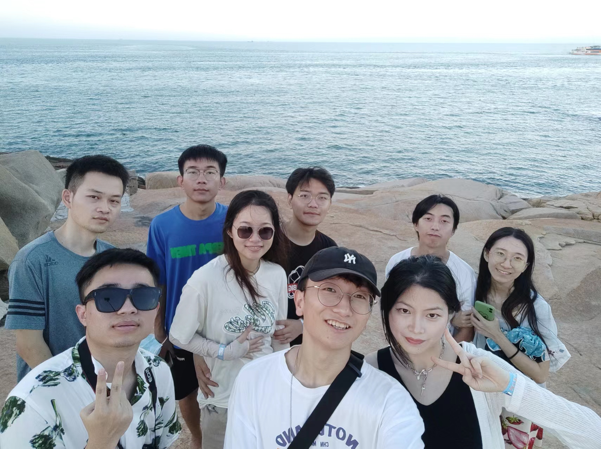
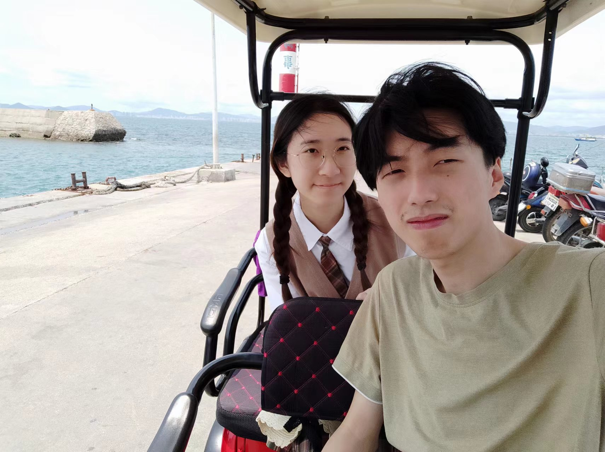
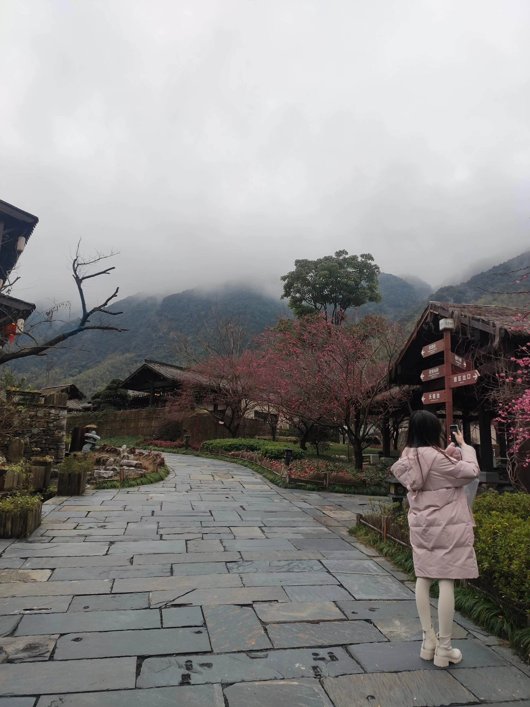
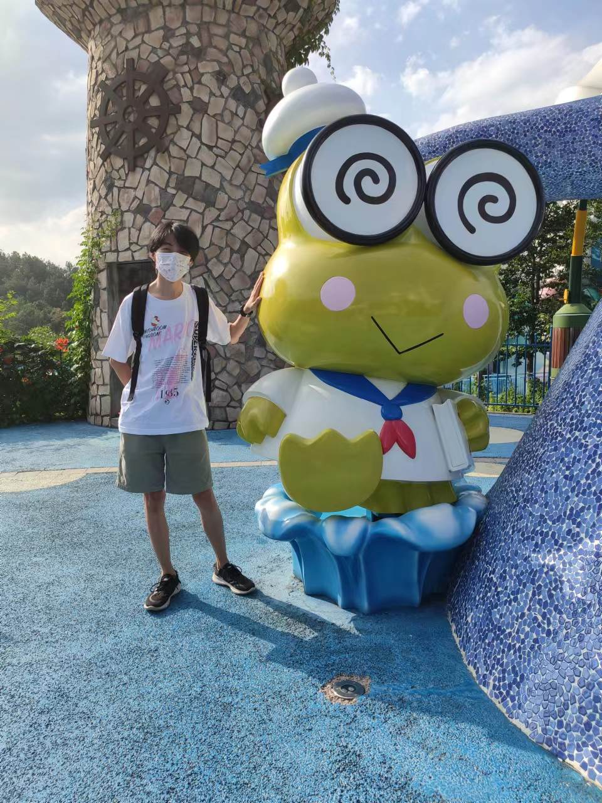
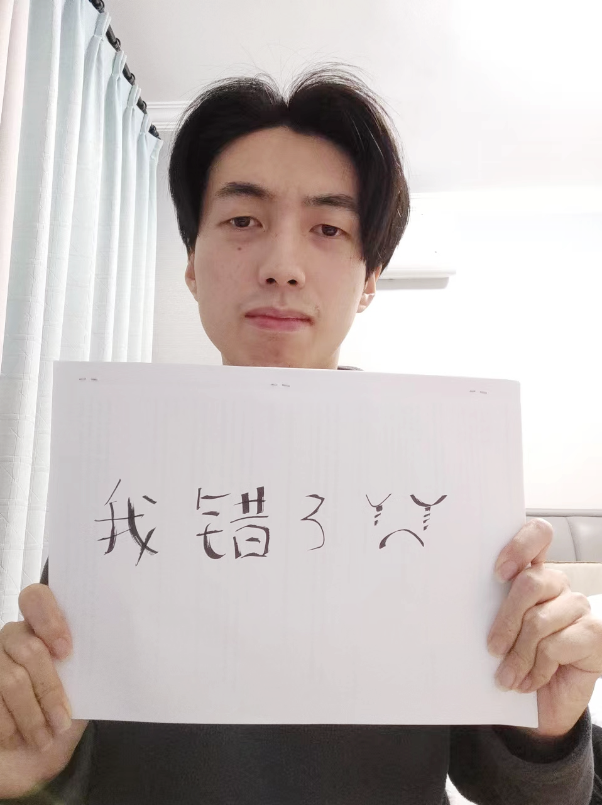
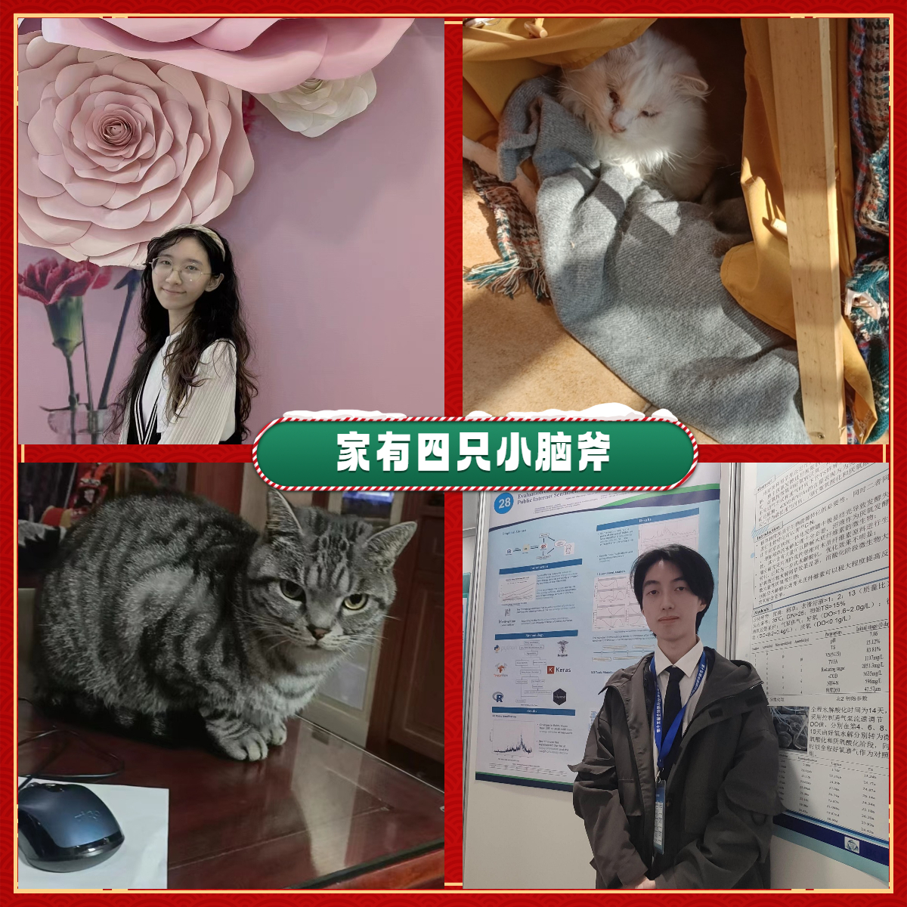

---
header:
  caption: ""
  image: ""
title: 我的忏悔
type: page
view: 2
---

### 这个页面属于我永远的宝贝

#### 我的忏悔与挽回

亲爱的宝，见信如晤

对不起，前两天失态，疯狂打扰你，我真的乱了，我深知自己不能失去你……。我反思良久，翻回去看我们之前的聊天记录，真的觉得自己很自以为是，为自己开脱、辩解，导致再次伤了你的心。

曾经，在我们吵完架，我总是有情绪了就找人聊天，我以为可以转移悲伤。但其实我这样给你带来了很大的伤害。这太自私了，同时你也会更加不信任我，我后知后觉，所以决心不再犯这样的错误。关于小红书的事件，我真的人格担保没有聊任何出格的事，这是我敢说的，也请你相信我。

我总是为自己找借口，不面对自己的错误，总是觉得自己对你好就可以抵消。事实上，我对你并不好，并且就算对你好，怎么可能抵消这些给你带来的伤害呢？最终这些因果，也只能让我自己更心痛。我知道我不是一个合格的男朋友，我不懂你的心，让我们的沟通失去了效果。我应该大方的承认自己错了，而不是一再逼迫你…

五年以来，我一直以一种自以为是的姿态同你相处。我们的矛盾被我一点点累积起来，最后让你失望、让你选择离开。这让我难过，每每想起我们在一起的快乐，鼻子就开始酸楚——我多希望能继续和你爱下去啊。

还记得今年夏天，我和你一起看了一片安静的海，在海边我好后悔没和你多拍几张照片。也懊恼自己拍照的技术怎么会那么烂，明明还号称玩过摄影。还是那个夏天，我们一群人住在帐篷里，帐篷好闷好热，早上有个没素质的SB吵你睡觉。我(以及我的狐朋狗友们)用小米的手机铃声，狠狠的替你收拾了他。

记得去年冬天吗？我们一起去了葛仙村，那里真的很漂亮，虽然我们错过了演出与雪，但跟你一起的时光，现在想起来，那家一点都不好吃的麻辣烫（你说是冒菜，我傻傻的分不清到底有什么区别），还是好想再吃一次。写着写着我怎么开始哭了…

还记得前年，你生日我们一起去了杭州与安吉，Hello Kitty的乐园真小，但是晚上的摩天轮，五彩斑斓的灯光炫目。摩天轮升空，隔壁坐了人，我们不好意思亲亲，但是留下了珍贵的照片。也是在杭州，西湖边上我们一起找十三余，我其实当时不知道这是个什么玩意，以为是喝茶的。最后你说是家衣服店，我们在地图的位置绕了好久，发现可能还没开业 囧。但也是那次难忘的寻找，我心里记下了这个名字。

今年圣诞，我脑海里想了很多东西，虽然AP和Baby也是你的挚爱，但是这里面的门路实在太多了，作为外行的我肯定是搞不明白。但是十三余你说过漂亮，也说过贵贵，那我就为你选了一件，希望你会喜欢。

说到为你买衣服，印象最深的是高中为你抢一条裙子，深夜一直在狂刷闲鱼，最后帮你买到的感觉真的特别特别开心。你那句夫复何求，是我黑暗岁月里最闪亮的光芒。但是从大二以来，我开始忙自己的科研，对你的关心却越来越少，给你的时间也变得越来越少了。我总以为未来可以天天在一起，我们会一起度过好多好多的岁月，但是其实，现实才是我最应该珍惜的。大学我们都经历了很多困难与挫折，那时候SB老师给你打低分，我非常生气，抱着你在我怀里。那时候我们闹矛盾，你说完分手，删除完好友，我一边哭着一边帮你写完作业。在同济读研，可能因为更远的异地，也因为我认识的新同学，让你充满了不安全感——而我这时候依然没有给你足够的爱与关心。钱很重要，但是你永远是最重要的，我不该忘记这些，不该让你感到委屈。那些过往的岁月，都让我们不分彼此，我应该认识到，因为是家人，更应该珍惜和爱。

可能看不到你穿这件衣服的照片了，但是我会一直爱你。就算是作为一个傍观者，我也愿意奉献我的真心。请接受我的道歉——我的自私、我的自以为是、我的不负责任。

永远爱你的夏夏

